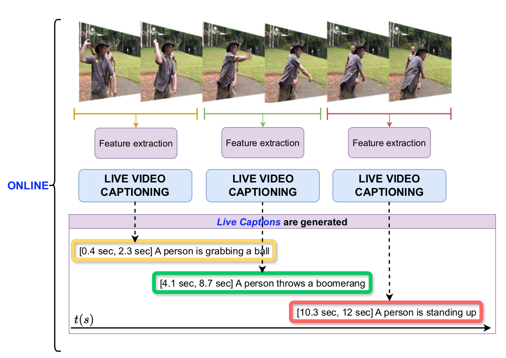

# Live Video Captioning

## Introduction to the Live Video Captioning Problem
[Live Video Captioning](https://paperswithcode.com/task/live-video-captioning) (LVC) involves detecting and describing dense events within video streams.

Traditional dense video captioning approaches typically focus on offline solutions where the entire video is available for analysis by the captioning model. 
In contrast, the LVC paradigm requires models to generate captions for video streams in an online manner. 
This imposes significant constraints, such as working with incomplete observations of the video and the need for temporal anticipation.

<p align="center">

</p>

In this repository we release the evaluation toolkit for the LVC problem, where we include the scripts for the novel Live Score metric detailed in our <a href="https://doi.org/10.1007/s11042-025-20908-w"> [paper]</a>.

**If you use any content of this repo for your work, please cite the following bib entry:**

    @article{lvc,
    author={Blanco-Fern{\'a}ndez, Eduardo and Guti{\'e}rrez-{\'A}lvarez, Carlos and Nasri, Nadia and Maldonado-Basc{\'o}n, Saturnino and L{\'o}pez-Sastre, Roberto J.},
    title={Live video captioning},
    journal={Multimedia Tools and Applications},
    year={2025},
    month={May},
    day={23},
    issn={1573-7721},
    doi={10.1007/s11042-025-20908-w},
    url={https://doi.org/10.1007/s11042-025-20908-w}
    }    


## Installation

**Dependencies**: 
- Python 3.9: We recommend using Anaconda to create a virtual environment with the required dependencies: `conda create -n lvc python=3.9`
  - Activate the environment: `conda activate lvc`
  - Python dependencies: `pip install -r requirements.txt`
- Java 1.8.0

Some basic instructions:
1. Clone this github repository.

2. Unzip the file with the LVC annotations for the ActivityNet Captions dataset.

```
cd lvc/data/validation
tar -xvzf data_validation.tar.gz 
```


## How to reproduce the results of our paper?

1. Unzip the file with the dense captions produced by our LVC model
```
cd lvc/data/captions
tar -xvzf data_captions.tar.gz 
```
2. To obtain the Live Score metric, for all the scorers used in our paper (METEOR, Bleu_4 and ROUGE_L), run the script: generate_results_lvc.py. This script will generate the results for the LVC model and the scorers used in our paper. The results will be saved in the `results` folder. Then, run the script average_scores.py


3. To obtain the live evolution of the Live Score metric for a particular video, run the following script: generate_images.py This script generates the images that we release in the paper, where one can observe the evolution of the novel metrics in all the videos.

Enjoy!

## How to generate your own results using the novel Live Score metric?

1. Save your LVC results in a JSON file. Use the JSON format detailed in the [ActivityNet Captions challenge](https://activity-net.org/challenges/2022/tasks/anet_captioning.html). We provide a sample JSON file in the results folder.
2. Specify the delta_t parameter your LVC model is using to cast the dense video captions, and run the generate_results_lvc.py with your JSON file.


## License

This repository is released under the GNU General Public License v3.0 License (refer to the LICENSE file for details).
